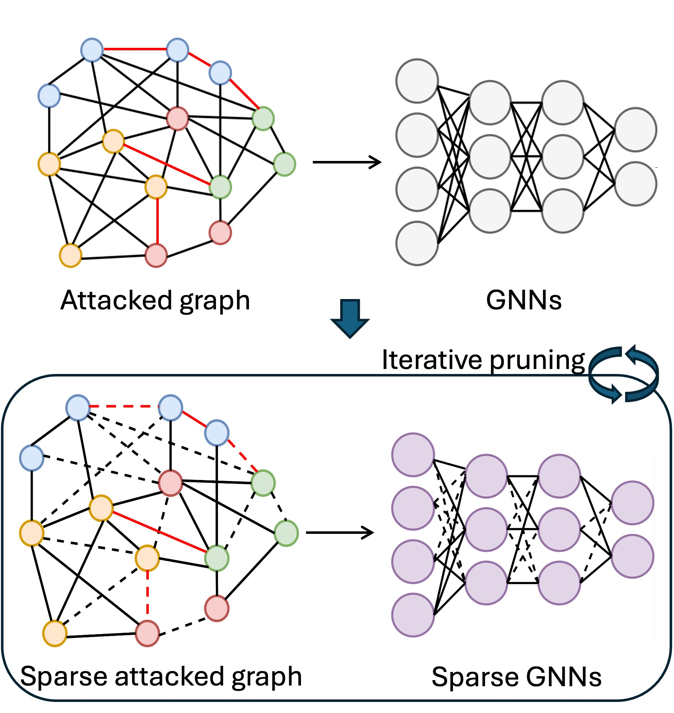

# Unveiling Adversarially Robust Graph Lottery Tickets

This repository is the official implementation of [**Unveiling Adversarially Robust Graph Lottery Tickets**](https://openreview.net/forum?id=PX06pUVs1P) (previously named 'Finding Adversarially Robust Graph Lottery Tickets') accepted by [TMLR](https://jmlr.org/tmlr/). You can also refer to our initial work presented at **ICASSP 2024 (Oral)** with the accompanying [slides](https://docs.google.com/presentation/d/1R9OJI6adcOibUc2wHNnM_NWS4p5Q2rUr/edit#slide=id.p1) and [paper link](https://ieeexplore.ieee.org/document/10448491).

Graph lottery tickets (GLTs) consist of a sparse graph neural network (GNN) and a sparse input graph adjacency matrix. While GLTs reduce the computational cost of GNNs, their robustness against adversarial attacks remains underexplored. This work introduces **Adversarially Robust Graph Sparsification (ARGS)**, a framework that iteratively prunes both the adjacency matrix and GNN weights to produce **Adversarially Robust Graph Lottery Tickets (ARGLTs)**. ARGS uses a novel loss function that captures graph homophily and integrates both true labels of training nodes and pseudo labels of test nodes. This dual-pruning approach identifies sparse yet robust GLTs that maintain high classification accuracy under various structure perturbation attacks, including PGD, MetaAttack, PR-BCD, GR-BCD, and adaptive attacks.



<a name="installation"></a>
## Installation

To install the dependencies, navigate to the project directory and run:

```bash
pip install -r requirements.txt
```

<a name="homophily"></a>
## Defense on Homophilic Graphs (to-do)

ARGS is evaluated on homophilic datasets like Cora, Citeseer, and PubMed under global structure poisoning attacks such as PGD and MetaAttack. The framework identifies ARGLTs that achieve similar accuracy as full models while reducing the graph and model sparsity by up to 98%. The results demonstrate the ability of ARGS to prune adversarial edges and maintain performance across different perturbation rates.

<a name="heterophily"></a>
## Defense on Heterophilic Graphs (to-do)

We extend the evaluation of ARGS to heterophilic datasets, such as Chameleon and Squirrel. The method uses a modified loss function that considers positional differences between connected nodes, improving robustness against adversarial modifications. Experimental results show that ARGS achieves higher graph sparsity while preserving classification accuracy compared to existing methods like GARNET.

<a name="large-graph"></a>
## Defense on Larger Graphs (to-do)

ARGS scales to large datasets like OGBN-ArXiv and OGBN-Products, where it is evaluated under advanced structure perturbations, including the PR-BCD and GR-BCD attacks. Despite the increased complexity of these datasets, ARGS maintains high classification accuracy while reducing graph and model sparsity. For instance, on the OGBN-ArXiv dataset, ARGS achieves comparable accuracy to dense models with 94.5% model sparsity and 48.7% graph sparsity.


## Code Acknowledgments

This repository builds on the following open-source implementations:

- [DeepRobust](https://github.com/DSE-MSU/DeepRobust): For implementing and benchmarking adversarial attacks on graphs.
- [Unified-LTH-GNN](https://github.com/VITA-Group/Unified-LTH-GNN): For the baseline Unified Graph Sparsification (UGS) method used to identify graph lottery tickets.


